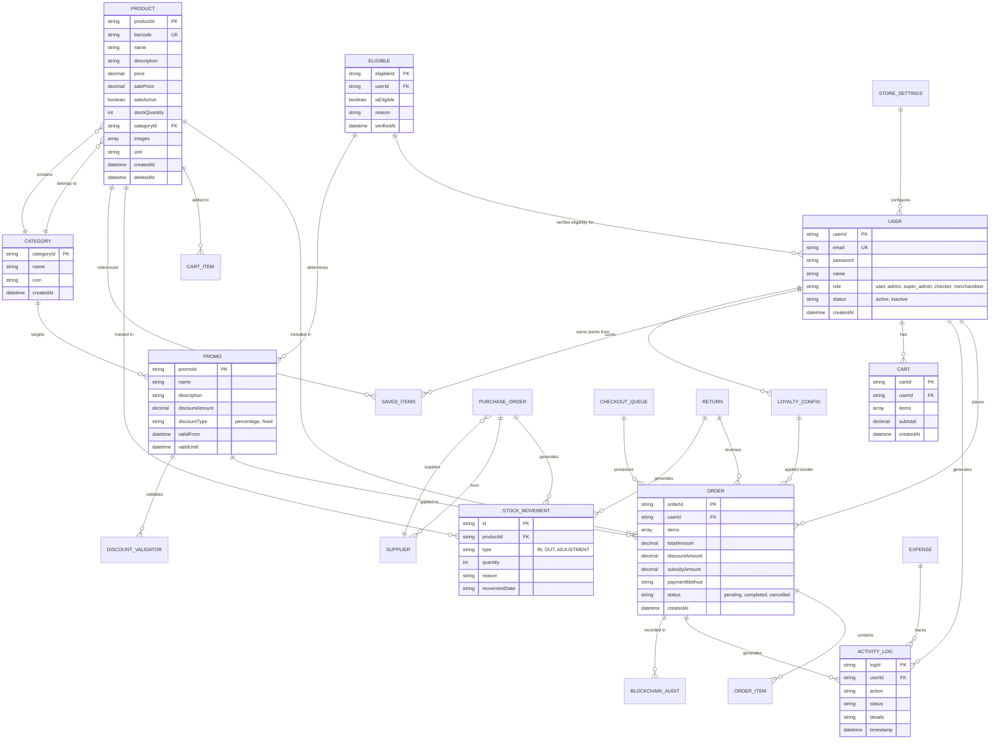
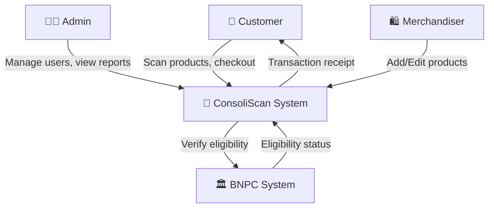
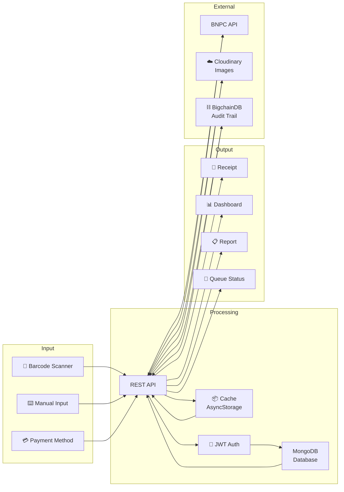
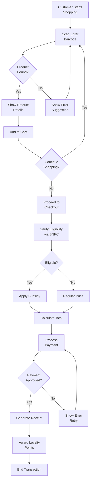
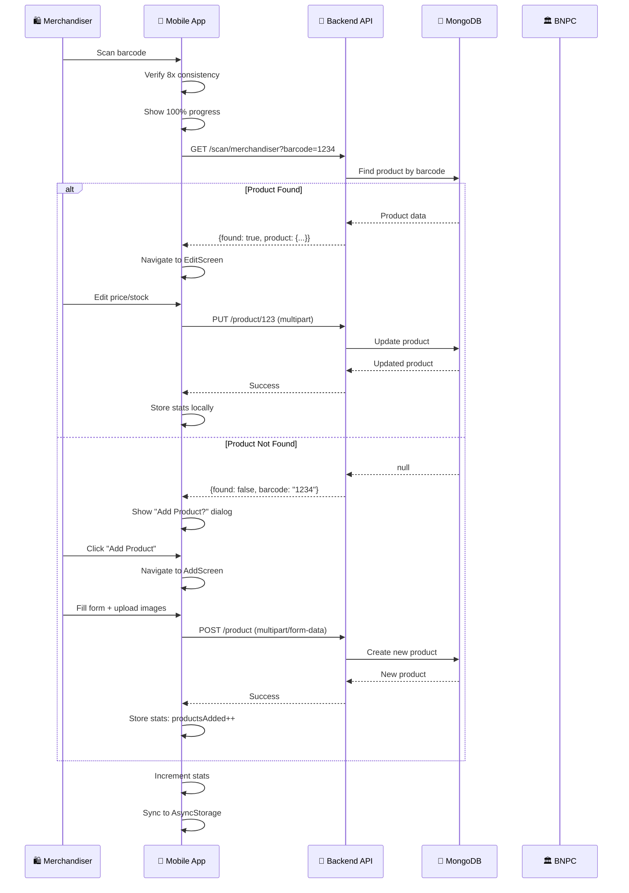
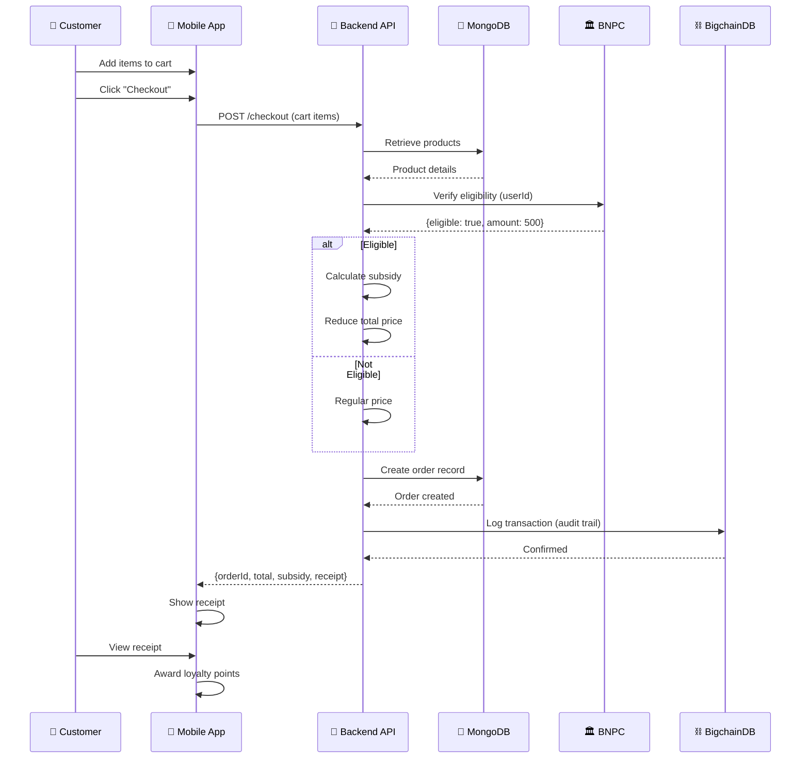
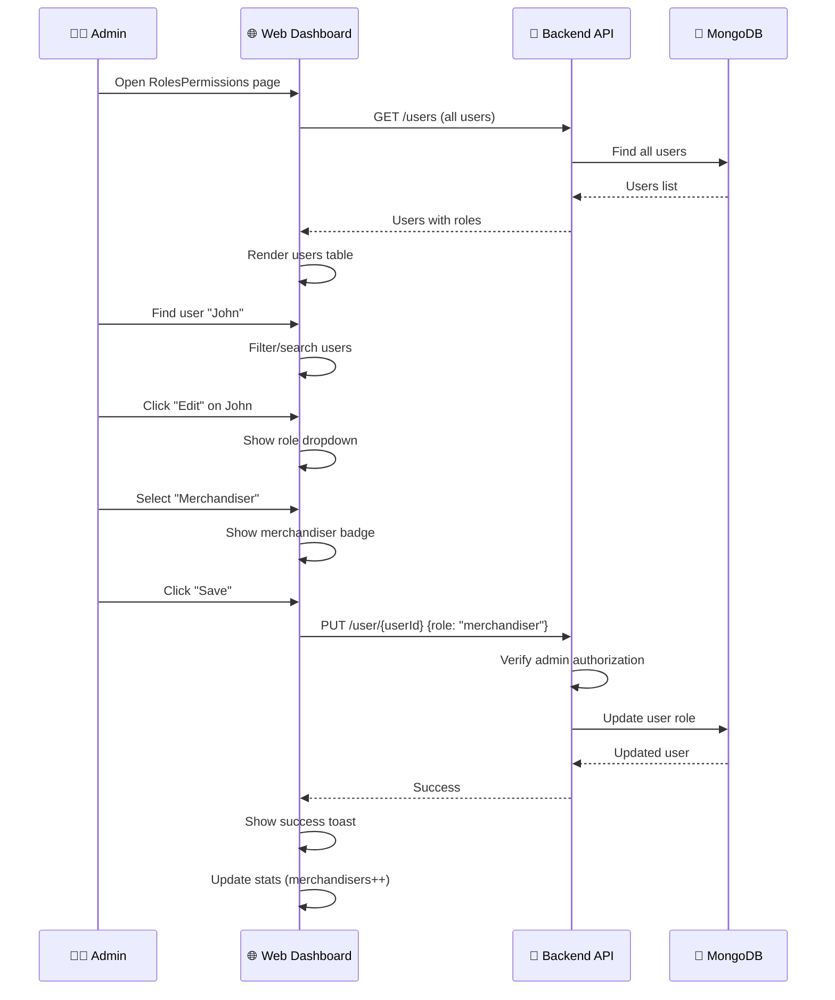
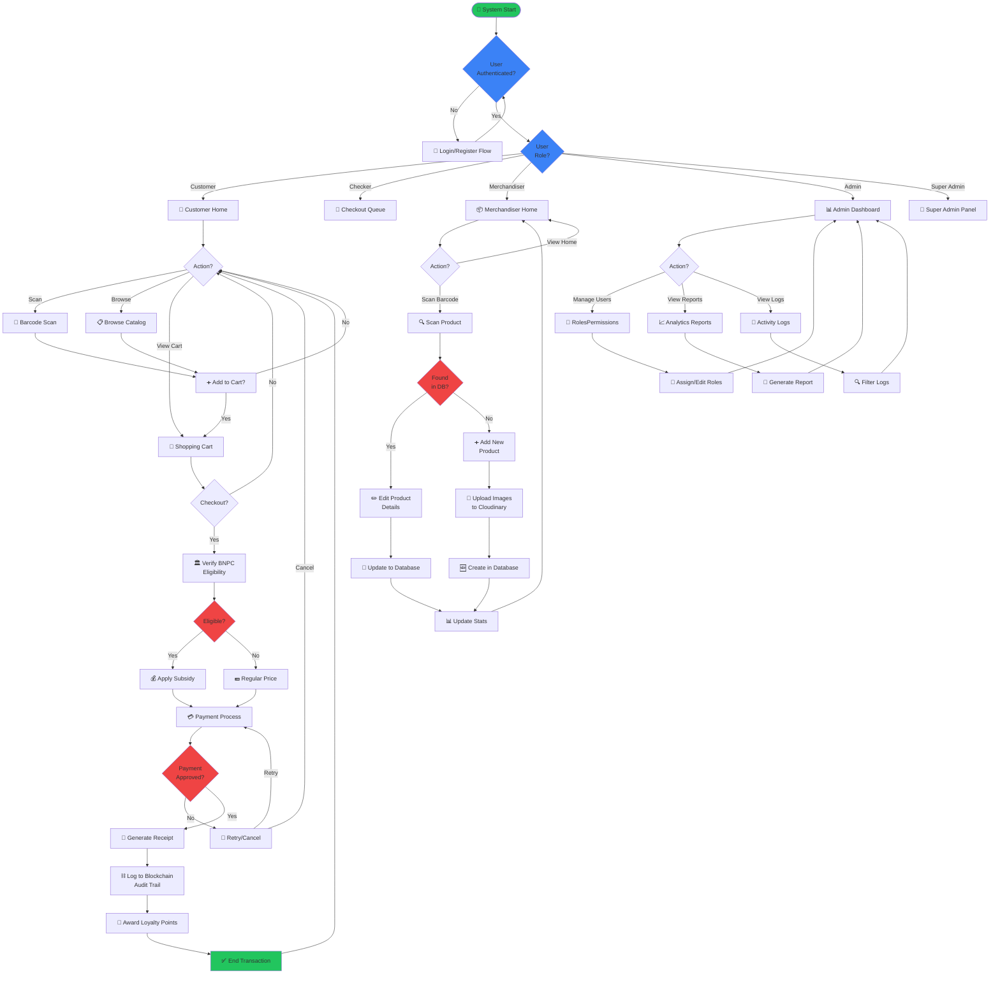

# ConsoliScan - System Documentation

> **Philippine Retail POS System with BNPC Government Subsidy Integration**

---

## 📋 Table of Contents

1. [System Context](#system-context)
2. [Use Cases](#use-cases)
3. [Entity Relationship Diagram (ERD)](#entity-relationship-diagram)
4. [Data Flow Diagram (DFD)](#data-flow-diagram)
5. [System Sequential Diagrams](#system-sequential-diagrams)
6. [System Flowchart](#system-flowchart)

---

## System Context

### 📌 Brief Overview

**ConsoliScan** is a comprehensive retail point-of-sale (POS) system designed for Philippine retailers, integrating government subsidy verification through BNPC (Bangko Ng Pilipinas Cooperative). The system manages inventory, transactions, employee workflows, and eligibility verification for subsidized products.

### Core Components

| Component                     | Purpose                                     | Technology                |
| ----------------------------- | ------------------------------------------- | ------------------------- |
| **Backend API**               | Business logic, database, authentication    | Node.js, Express, MongoDB |
| **Web Admin Panel**           | Admin dashboard, reporting, user management | React, Vite, Material-UI  |
| **Mobile App (Customer)**     | Customer checkout, product scanning         | React Native, Expo        |
| **Mobile App (Merchandiser)** | Inventory management, product scanning      | React Native, Expo        |
| **ML Service**                | Product detection via barcode scanning      | FastAPI, YOLOv8, PyTorch  |

### Key Features

- ✅ Multi-role access (User, Admin, Super Admin, Checker, Merchandiser)
- ✅ Real-time inventory tracking
- ✅ Government subsidy eligibility verification
- ✅ Offline-first transaction capability
- ✅ Barcode scanning with AI detection
- ✅ Checkout queue management
- ✅ Loyalty rewards system
- ✅ Blockchain audit trails (BigchainDB)
- ✅ Sales analytics & reporting

---

## Use Cases

### 🧑‍💼 Use Case 1: Customer Shopping & Checkout

**Actor**: Customer (User Role)

**Main Flow**:

1. Customer enters store
2. System verifies BNPC eligibility status
3. Customer scans products or enters manually
4. System shows product details and availability
5. Customer adds items to cart
6. Customer proceeds to checkout
7. System calculates total (applies subsidies if eligible)
8. Payment is processed
9. Receipt is generated
10. Loyalty points are awarded

**Alternative**: Offline mode - transactions sync when online

---

### 🏪 Use Case 2: Merchandiser Product Management

**Actor**: Merchandiser (New Role)

**Main Flow**:

1. Merchandiser scans barcode of product
2. System searches local catalog first, then API
3. **If Product Exists**:
   - Shows product details (name, price, stock, category)
   - Merchandiser can edit (price, stock, images, category)
   - System updates product in database
   - Stats updated (productsUpdated++)

4. **If Product Not Found**:
   - System offers to create new product
   - Merchandiser fills product form (name, barcode, price, category, images)
   - System validates and creates product
   - Stats updated (productsAdded++)

**Offline Support**: Scans cached in buffer, API calls when online

---

### 👨‍💼 Use Case 3: Admin User Management

**Actor**: Admin

**Main Flow**:

1. Admin accesses RolesPermissions page
2. Views all users with roles (User, Admin, Super Admin, Checker, Merchandiser)
3. Can assign roles to users
4. Can filter by role
5. Can view activity logs per role
6. System displays statistics (total users per role)

---

### 🔐 Use Case 4: BNPC Subsidy Verification

**Actor**: System + Checker Role

**Main Flow**:

1. Customer initiates checkout
2. System queries eligibility status from BNPC integration
3. Checker reviews eligibility details
4. If eligible: subsidy is applied automatically
5. Total price is recalculated
6. Receipt shows subsidy amount
7. Transaction is logged with subsidy details

---

### 📊 Use Case 5: Admin Dashboard Analytics

**Actor**: Super Admin / Admin

**Main Flow**:

1. Admin views dashboard
2. System displays:
   - Total daily/weekly/monthly sales
   - Revenue breakdown by category
   - Inventory status
   - User activity logs
   - Subsidy statistics
   - Checkout queue metrics
3. Admin can generate reports
4. Reports can be exported as PDF/CSV

---

## Entity Relationship Diagram



---

## Data Flow Diagram

### Level 0: System Context



### Level 1: Main Data Flows



### Level 2: Customer Checkout Flow



---

## System Sequential Diagrams

### Sequence 1: Merchandiser Scan & Update Product



### Sequence 2: Customer Checkout with Subsidy



### Sequence 3: Admin Assign Merchandiser Role



---

## System Flowchart

### Main System Flow



### Offline-First Transaction Flow

```mermaid
flowchart LR
    OnlineCheck{Device<br/>Online?}

    OnlineCheck -->|Yes| OnlineMode["🟢 Online Mode"]
    OnlineCheck -->|No| OfflineMode["🔴 Offline Mode"]

    OnlineMode --> RealTimeAPI["⚡ Real-time API Calls"]
    RealTimeAPI --> ImmediateSync["📡 Immediate Sync"]
    ImmediateSync --> UpdateDB["💾 Update Server DB"]

    OfflineMode --> LocalStorage["💿 Store in AsyncStorage"]
    LocalStorage --> QueueTrans["📋 Queue Transactions"]
    QueueTrans --> CacheData["📦 Cache Catalog"]

    CacheData --> OfflineOps["✅ Perform Operations<br/>Offline"]
    OfflineOps --> WaitOnline["⏳ Waiting for<br/>Connection..."]

    WaitOnline --> OnlineNotif["🔗 Connection Restored"]
    OnlineNotif --> SyncPending["🔄 Sync Pending<br/>Transactions"]
    SyncPending --> RepreyFailed["🔁 Retry Failed<br/>Operations"]
    RepreyFailed --> UpdateDB

    UpdateDB --> SyncComplete["✅ Sync Complete"]
    SyncComplete --> ClearQueue["🗑️ Clear Queue"]

    style OnlineMode fill:#22c55e
    style OfflineMode fill:#f97316
    style SyncComplete fill:#22c55e
```



---

## Key Data Models

### User Model

```json
{
  "userId": "unique_id",
  "email": "user@example.com",
  "name": "John Doe",
  "role": "merchandiser|user|checker|admin|super_admin",
  "status": "active|inactive",
  "createdAt": "2024-01-01",
  "lastLogin": "2024-03-07"
}
```

### Product Model

```json
{
  "productId": "unique_id",
  "barcode": "1234567890",
  "name": "Product Name",
  "price": 99.99,
  "salePrice": 79.99,
  "saleActive": true,
  "stockQuantity": 150,
  "categoryId": "cat_001",
  "images": [{ "url": "...", "public_id": "..." }],
  "description": "Product description",
  "unit": "pc|kg|box",
  "createdAt": "2024-01-01",
  "deletedAt": null
}
```

### Order Model

```json
{
  "orderId": "unique_id",
  "userId": "user_001",
  "items": [
    {
      "productId": "prod_001",
      "quantity": 2,
      "unitPrice": 99.99,
      "subtotal": 199.98
    }
  ],
  "totalAmount": 299.98,
  "discountAmount": 20.0,
  "subsidyAmount": 50.0,
  "finalAmount": 229.98,
  "paymentMethod": "cash|card|gcash",
  "status": "completed",
  "createdAt": "2024-03-07"
}
```

---

## Technology Stack

| Layer              | Technology                | Purpose                      |
| ------------------ | ------------------------- | ---------------------------- |
| **Frontend**       | React, Vite, Material-UI  | Admin dashboard              |
| **Mobile**         | React Native, Expo        | Customer & Merchandiser apps |
| **Backend**        | Node.js, Express          | REST API                     |
| **Database**       | MongoDB, Mongoose         | Data persistence             |
| **Authentication** | JWT, Firebase             | Secure access                |
| **Real-time**      | Socket.io                 | Live notifications           |
| **File Storage**   | Cloudinary                | Image management             |
| **Audit Trail**    | BigchainDB                | Blockchain records           |
| **Payment**        | Integration ready         | Payment processing           |
| **ML/AI**          | FastAPI, YOLOv8           | Product detection            |
| **Cache**          | AsyncStorage, Redis ready | Client-side & server caching |

---

## Integration Points

```
┌─────────────────────────────────────────────────────────────┐
│                    ConsoliScan System                       │
├─────────────────────────────────────────────────────────────┤
│                                                             │
│  ┌──────────────┐         ┌──────────────┐                 │
│  │  REST API    │◄───────►│  MongoDB     │                 │
│  │  (Node.js)   │         │  Database    │                 │
│  └──────────────┘         └──────────────┘                 │
│         ▲                                                   │
│    ┌────┼────┬────────┬──────────┬──────────┐               │
│    │    │    │        │          │          │               │
│    ▼    ▼    ▼        ▼          ▼          ▼               │
│  ┌───┐ ┌───┐ ┌──────┐ ┌────────┐ ┌────────┐ ┌────────┐    │
│  │Web│ │App│ │BNPC  │ │Firebase│ │Cloudry│ │Bigchain│   │
│  │UI │ │CLI│ │API   │ │Auth    │ │Images │ │DB      │   │
│  └───┘ └───┘ └──────┘ └────────┘ └────────┘ └────────┘    │
│                                                             │
└─────────────────────────────────────────────────────────────┘
```

---

## System Constraints & Considerations

### Performance

- Offline-first architecture reduces latency
- AsyncStorage caching for frequent data
- Redis integration ready for scaling
- Database indexing on barcode, email, userId

### Security

- JWT token-based authentication
- Role-based access control (RBAC)
- Encrypted password storage
- Audit logging on all transactions
- Blockchain verification for high-value transactions

### Scalability

- Microservices-ready architecture
- API gateway pattern implemented
- Database replication ready
- Load balancing compatible

### Reliability

- Transaction rollback on failure
- Duplicate detection on scans
- Error recovery mechanisms
- Comprehensive logging

---

## Deployment Architecture

```
┌─────────────────────────────────────────────────────────┐
│                   Internet                              │
└────────┬──────────────────────────────────────────────┬─┘
         │                                              │
    ┌────▼────┐                                   ┌────▼────┐
    │ Web UI  │◄──────────────────────►           │  Mobile │
    │ React   │     HTTPS/WebSocket              │ Apps    │
    │ (Custom │                                   │ (Expo)  │
    │ Domain) │                                   │         │
    └─────────┘                                   └────┬────┘
              │                                       │
              └───────────────┬──────────────────────┘
                              │
                    ┌─────────▼──────────┐
                    │   API Gateway      │
                    │   (Load Balancer)  │
                    └─────────┬──────────┘
                              │
              ┌───────────────┼───────────────┐
              │               │               │
         ┌────▼──────┐   ┌────▼──────┐  ┌────▼──────┐
         │ Backend 1  │   │ Backend 2  │  │ Backend N │
         │(Node.js)   │   │(Node.js)   │  │(Node.js)  │
         └────┬───────┘   └────┬───────┘  └────┬──────┘
              │               │               │
              └───────────────┼───────────────┘
                              │
                    ┌─────────▼──────────┐
                    │  MongoDB Cluster   │
                    │  (Replication Set) │
                    └────────────────────┘
```

---

## Future Enhancements

- [ ] Multi-currency support
- [ ] Advanced analytics with ML predictions
- [ ] Real-time inventory sync across branches
- [ ] Mobile payment integration (GCash, PayMaya)
- [ ] Facial recognition for loyalty rewards
- [ ] IoT-based vending machine support
- [ ] Sustainability tracking (carbon footprint)
- [ ] Supply chain transparency (from farm to store)

---

**Document Version**: 1.0  
**Last Updated**: March 7, 2026  
**System Status**: ✅ Production Ready
